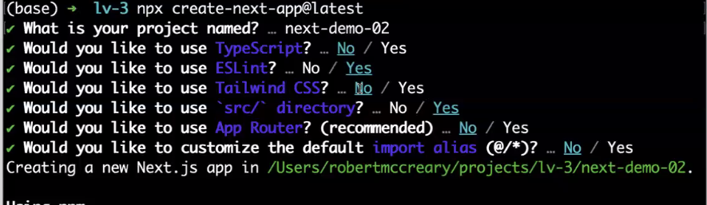

# Next.js Inspirational Quotes App

This is a simple web application built with Next.js that displays an inspirational quote on the homepage and some background about Master Oogway on the About page. This project is part of an assignment to get familiar with the Next.js framework, focusing on project setup, routing, and creating components.

## Objective

The purpose of this project is to explore how Next.js works by creating a basic app, modifying pages, and understanding file structure, while also learning how to push a local project's code to a remote Github repository.

## Setting Up Next.js Project

1. Run the following command to create a new Next.js project:

```bash
npx create-next-app@latest
```

2. A prompt will pop; here is an example of what I selected.
   

3. Navigate into the project directory:

```bash
cd project-name
```

4. To run the development server:

```bash
npm run dev
```

## Creating A Page

1. Modified the default homepage content in `src/pages/index.js` to display a quote.
2. Create a new page:
   - Create a directory (folder) name `about` inside the `pages` directory.
   - Create an `index.js` file within the `about` directory with some content about Master Oogway.

## Running Appilication

Run the development server using:

```bash
npm run dev
```

You can view the application at:

- http:/localhost:3000 (Homepage)
- http:/localhost:3000/about (About Page)

## GitHub Repository Setup

1. Push local project to Github with the following steps:

- Create a new repository on Github without a README.
- Link your local repository with:

```bash
git remote add origin https://github.com/yourusername/your-repository.git
git branch -M main
git push -u origin main
```

## Screenshots

### Home


### About


